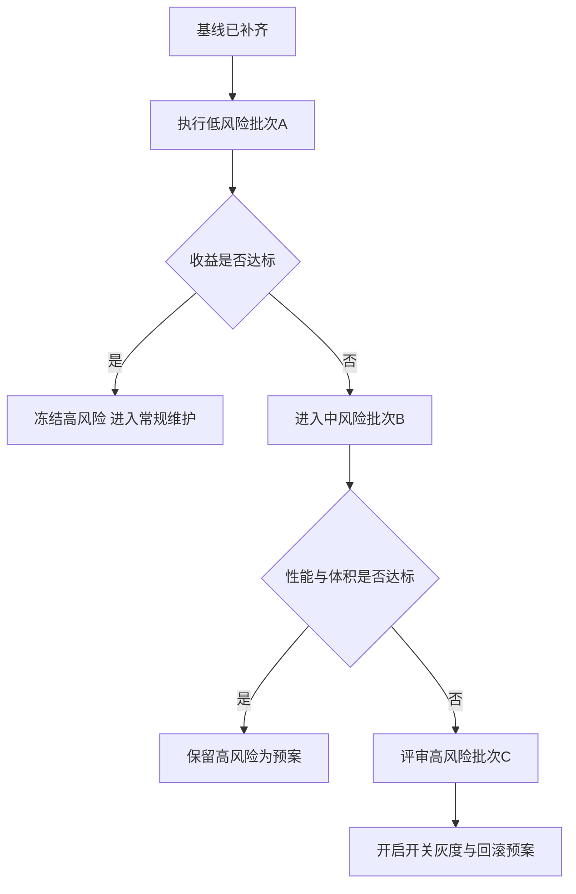

# 第二轮优化规划与决策面板

## 0. 输入边界

- 允许执行原需求中的 1/2/4
- 允许规划高风险方案
- 当前阶段目标：先建立体积与构建基线，再给出低/中/高风险方案与决策面板

## 1. 基线数据

### 1.1 构建产物

- Debug APK：`29275 KB`
- Release APK：`22209 KB`
- 体积差值（Debug-Release）：`7066 KB`
- Release 相对 Debug 收缩：`24.14%`

### 1.2 构建耗时

- Debug 构建：`5 s`
- Release 构建：`15 s`

### 1.3 当前工程观察

- Release 混淆压缩关闭：[`release { isMinifyEnabled = false }`](../app/build.gradle.kts:27)
- 使用 Compose + Material3 + Navigation 作为设置页栈：[`dependencies { ... }`](../app/build.gradle.kts:43)
- 刷新热路径存在并发闸门与节流：[`enterRefreshGate`](../app/src/main/java/com/example/onequote/data/repo/QuoteRepository.kt:372)
- 刷新循环包含实时启用态二次校验：[`isSourceEnabledForRefresh`](../app/src/main/java/com/example/onequote/data/repo/QuoteRepository.kt:357)

---

## 2. 低风险方案 可立即实施

### L1 打开 Release 代码压缩与资源收缩

- 变更点
  - 在 [`release`](../app/build.gradle.kts:26) 开启 `isMinifyEnabled = true`
  - 同时开启 `isShrinkResources = true`
- 目标
  - 直接压缩方法数与未使用资源
- 验证
  - 对比新旧 Release APK 体积
  - 关键路径冒烟：启动 设置页 手动刷新 自动刷新 小组件更新
- 回滚
  - 仅回退 [`app/build.gradle.kts`](../app/build.gradle.kts)

### L2 Debug 日志构建期裁剪

- 变更点
  - 将 [`AppDebugLogger`](../app/src/main/java/com/example/onequote/data/util/AppDebugLogger.kt) 的调用在 Release 构建下裁剪
- 目标
  - 降低运行期字符串拼接与日志开销
- 验证
  - Release 包内日志调用显著减少
  - 行为一致性回归

### L3 刷新热路径微优化

- 变更点
  - 在 [`refreshFromEnabledSources`](../app/src/main/java/com/example/onequote/data/repo/QuoteRepository.kt:276) 中减少重复对象创建与不必要 map 更新
- 目标
  - 降低刷新高频时 CPU 与内存抖动
- 验证
  - 连续手动刷新情况下耗时与失败率稳定

---

## 3. 中风险方案 需小范围回归

### M1 数据模型与序列化结构瘦身

- 变更点
  - 对 [`QuoteModels.kt`](../app/src/main/java/com/example/onequote/data/model/QuoteModels.kt) 执行字段复用与冗余字段清理
- 风险
  - DataStore 兼容性与旧数据迁移
- 收益
  - 降低序列化成本与持久化数据体积
- 回滚
  - 保留兼容读取分支 一键切回旧字段

### M2 刷新状态写入去抖

- 变更点
  - 合并 [`store.update`](../app/src/main/java/com/example/onequote/data/repo/QuoteRepository.kt:310) 的频繁写操作
- 风险
  - 状态显示时序变化
- 收益
  - 降低 IO 与锁竞争

### M3 Widget 渲染路径轻量化

- 变更点
  - 优化 [`WidgetShadowLayerRenderer`](../app/src/main/java/com/example/onequote/widget/WidgetShadowLayerRenderer.kt) 的阴影绘制策略
- 风险
  - 视觉表现与旧样式轻微差异
- 收益
  - 降低 RemoteViews 更新成本

---

## 4. 高风险方案 可规划可择机落地

### H1 设置页去 Compose 化或模块拆分

- 方向 A
  - 设置页从 Compose 迁移为 View 系
- 方向 B
  - 保留 Compose 但按特性拆分模块与依赖边界
- 风险
  - UI 重写工作量大 回归面广
- 潜在收益
  - 进一步压缩包体与启动负载
- 回滚
  - 分支隔离 按页面逐步切换

### H2 网络栈替换或自研轻量请求层

- 变更点
  - 替换 [`okhttp`](../gradle/libs.versions.toml:35) 或以更轻层封装常用能力
- 风险
  - 稳定性与边界错误处理复杂度上升
- 潜在收益
  - 依赖树与包体继续下降
- 回滚
  - 抽象接口保留 双实现切换

### H3 刷新架构重构

- 变更点
  - 将 [`QuoteRepository`](../app/src/main/java/com/example/onequote/data/repo/QuoteRepository.kt) 中刷新 状态 熔断逻辑拆分为独立策略组件
- 风险
  - 并发时序 bug 风险高
- 潜在收益
  - 可维护性与可观测性显著提高 为后续性能优化铺路
- 回滚
  - 保留旧流程开关 快速切回

---

## 5. 分批实施计划

1. 批次 A 低风险快速收益
   - L1 + L2 + L3
2. 批次 B 中风险受控推进
   - M2 -> M3 -> M1
3. 批次 C 高风险按开关灰度
   - H3 先行 评估后再决策 H1/H2

---

## 6. 决策面板

| 方案                  | 风险级别 | 预期收益方向         | 主要副作用            | 回滚复杂度 | 建议优先级 |
| --------------------- | -------- | -------------------- | --------------------- | ---------- | ---------- |
| L1 开启混淆与资源收缩 | 低       | 包体下降最直接       | 反射/序列化规则需补齐 | 低         | P0         |
| L2 日志裁剪           | 低       | 运行期开销下降       | 排障日志减少          | 低         | P0         |
| L3 刷新热路径微优化   | 低       | 刷新稳定性与性能     | 代码可读性略降        | 低         | P1         |
| M2 写入去抖           | 中       | IO 与锁竞争下降      | 状态更新时序变化      | 中         | P1         |
| M3 渲染路径轻量化     | 中       | 小组件刷新性能提升   | 视觉一致性回归成本    | 中         | P2         |
| M1 模型瘦身           | 中       | 存储与解析成本下降   | 数据兼容迁移风险      | 中         | P2         |
| H3 刷新架构重构       | 高       | 可维护性与上限提升   | 并发场景回归复杂      | 高         | P2         |
| H1 设置页重构         | 高       | 潜在包体与冷启动收益 | UI 全面回归           | 高         | P3         |
| H2 网络栈替换         | 高       | 依赖与体积进一步下降 | 稳定性风险高          | 高         | P3         |

---

## 7. Mermaid 决策流程图

